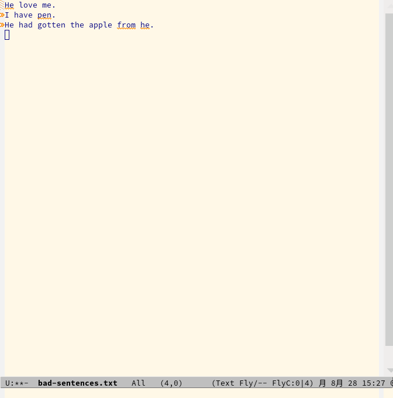

# English grammar check with link-grammar for Emacs/flycheck-mode




## How to use
For pkgsrc users, install `emacs29` and `py-link-grammar` packages:
```
$ cd /usr/pkgsrc/editors/emacs29
$ make install
$ cd /usr/pkgsrc/textproc/py-link-grammar
$ make install
```

And install `sentence-check.py` as `/opt/bin/sentence-check.py`.

Then add the following to your `~/.emacs`:
In this example, English grammar check is enabled for `text-mode`
and `notmuch-message-mode`.

```
(require 'flycheck)
(flycheck-define-checker english-link-grammar
    "Natural language (English) grammar check by link-grammar"
    :command ("/opt/bin/sentence-check.py" "--file" source)
    :error-patterns ((warning line-start (file-name) ":LINE:" line ":COLUMN:" column ":" (message) line-end))
    :modes (text-mode notmuch-message-mode))
(add-to-list 'flycheck-checkers 'english-link-grammar)
(add-hook 'text-mode-hook 'flycheck-mode)
(add-hook 'notmuch-message-mode-hook 'flycheck-mode)

```

## Bugs
* Remove position option.
* Not optimized at all.
